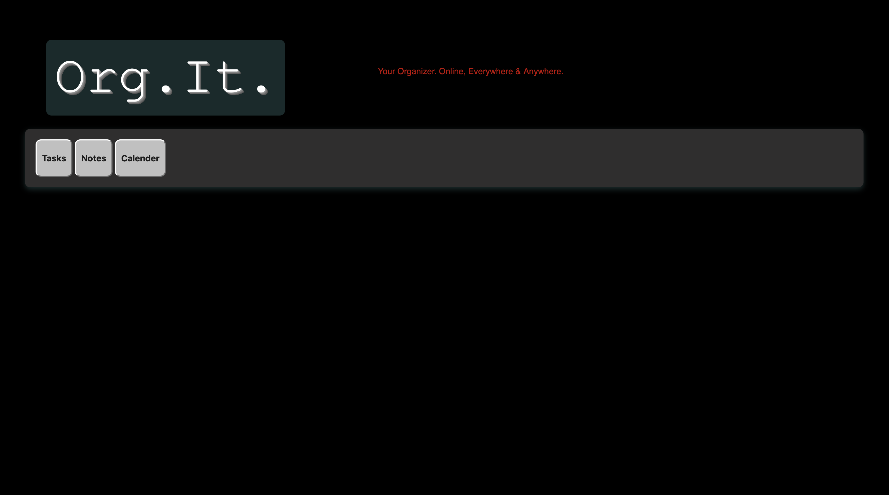

<h1 class="logo-text">Org.It.</h1>
Your Organizer. Online, Everywhere & Anywhere.

Features

| Feature | Status |
|---------|--------|
| List-it | ✅ Complete |
| Notes   | ✅ New Feature, 🚧 In Progress |
| Calendar | 🚧 In Progress |
| Mail | 📅 Planned |

<h1>Previews</h1>
images/orgit home.png

<h1>Usage</h1>

Enter a task in the input field
Click "Add" to add it to your list
Click on a task to mark it as completed
Click the "×" to remove a specific task
Click "Mark all as Done" to clear your entire list

<h1>Installation</h1>
Local Setup

Clone the repository:

bashCopygit clone https://github.com/Bruh-Ryan/Org.It

Open the index.html file in your browser

Required Files

index.html - Main HTML structure
fontStyle.css - Font styling and additional CSS rules

<h1>Project Structure</h1>
Copyorg-it/
├── index.html          # Main HTML file with app structure and JavaScript
├── fontStyle.css       # CSS styling for fonts and UI elements
└── README.md           # This documentation file
Planned Features

Calendar Integration: Schedule tasks with reminders
Mail Integration: Manage email communications
Data Persistence: Save your tasks locally or in the cloud
Mobile Responsive Design: Use on any device
Dark/Light Mode Toggle: Choose your preferred theme

<h1>Browser Support</h1>

Chrome (latest)
Firefox (latest)
Safari (latest)
Edge (latest)

Contributing

License
This project is licensed under the MIT License - see the LICENSE file for details.
Contact
Name -ryanpaultirkey@gmail.com
Project Link: https://github.com/Bruh-Ryan/Org.It

Note: This project is currently in development. Some features mentioned in the menu (Calendar, Mail) may not be fully implemented yet
